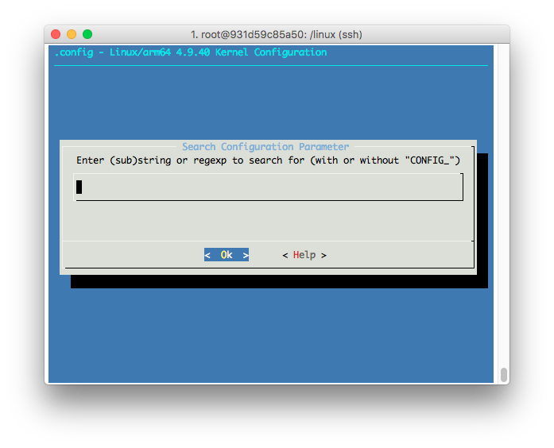
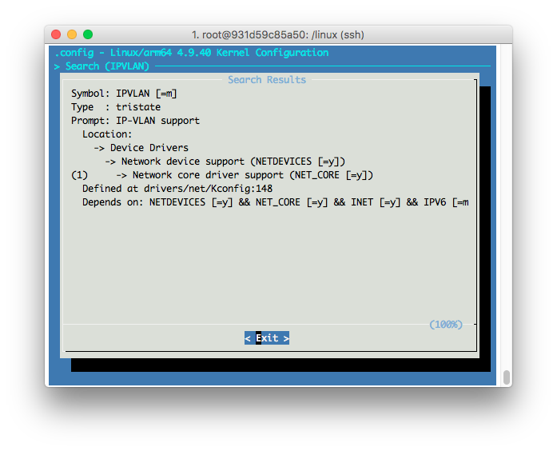

# ARM64 Kernel Builder

- Raspberry PI
- Pine64

## Kernel Options Configuration

- Search a target option  
  
- Enable/Disable or make it module
  
- Make sure Depedencies are also checked and enabled

**In these way, we can build a proper custom configuration w/ dependency for kernel build**

## Manual Docker Run

```sh
docker ps --filter "status=exited" | awk '{print $1}' | xargs --no-run-if-empty docker rm
docker run -it --name rpi-kernel64 -v ${PWD}/linux:/linux -v ${PWD}/output:/output rpi-kernel64 /bin/bash
```

## Post Kernel Installation and manul configuration

Most of installation script is done within build container. You can take a look at RPI version [here](RPI/4.9.y/build_kernel.sh).  

Nonetheless, it might still need to reiterate a couple of time to properly remove all the redundant modules and firmwares.  
Once an iteration of optimization is done, make sure you run `depmod` to refresh `/lib/modules/<version>/modules.*.bin` so that Docker engine can use it.
